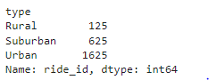
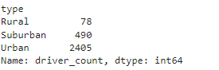
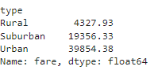
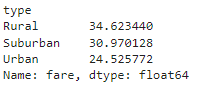
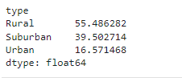
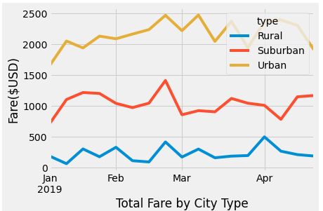

# PyBer_Analysis

## Overview
After the succes of the inital project for Visulaiize, The following assignment has been given:
* Create a summary DataFrame of the ride-sharing data by city type.
* Use Pandas and Matplotlib to create a multiple-line graph that shows the total weekly fares for each city type. 
* Summarize how the data differs by city type and how those differences can be used by decision-makers at PyBer.

## Results

Number of rides per city type

Number of drivers per city type

Total fare per City type

Average fare per ride per city type

Average fare per driver per city type

total weekly estimate of total fares by city type

## Summary
